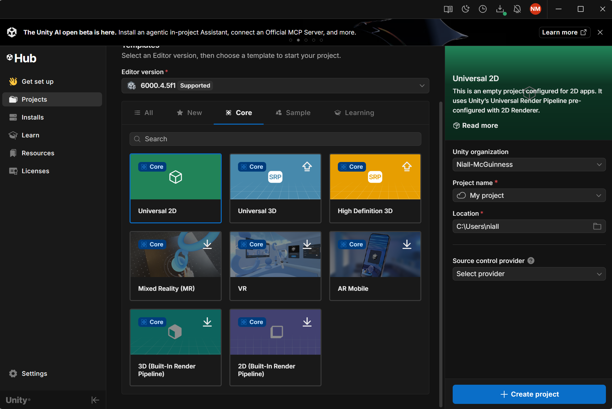
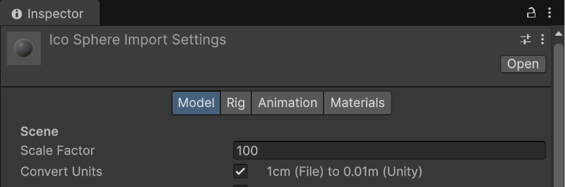
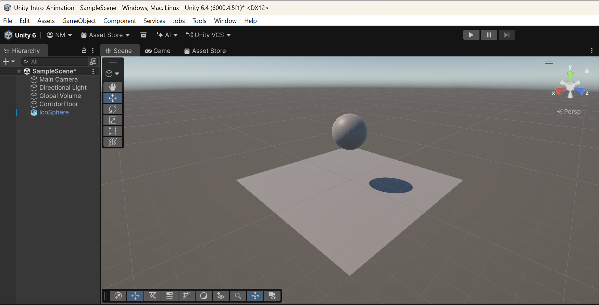
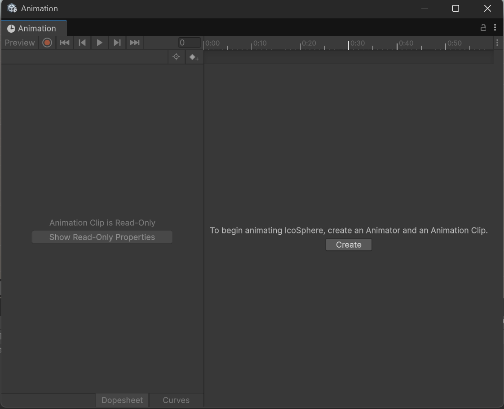
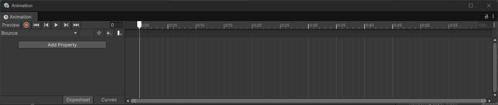
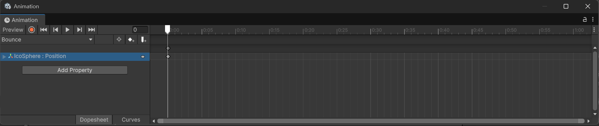
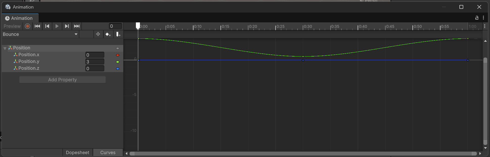
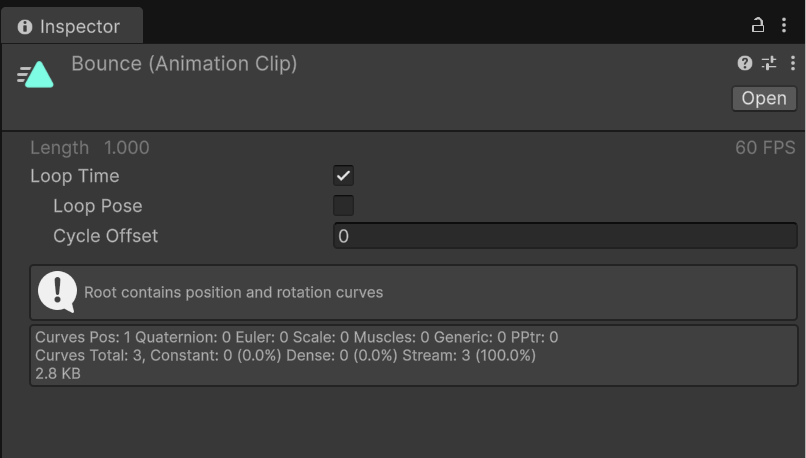
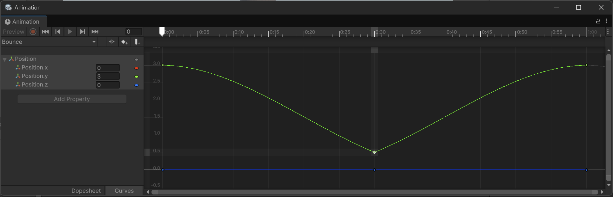

# Lab 1: Animating a Bouncing Ball
> **Prerequisites:**
> - You have Unity 6.4 LTS installed via Unity Hub.
> - You can open a project, save a scene, and add primitive GameObjects.
> - You have your `IcoSphere.fbx` file from your Blender module ready to import.
> - You have cloned the labs [repo](https://github.com/nmcguinness/Unity-Intro) to your machine. 
> - You have **30 minutes** of uninterrupted lab time.

---

## **What you'll learn**

| Skill Type | You will be able to… |
| :-- | :-- |
| **Conceptual Understanding** | Explain the difference between an Animation Clip and an Animator Controller, and describe what a keyframe is. |
| **Editor & Tool Fluency** | Import a Blender FBX correctly, open the Animation window, enter and exit Record mode, and switch between Dopesheet and Curves views. |
| **Design Skills** | Use animation curves and squash & stretch to make motion feel weighted and intentional rather than mechanical. |
| **Problem-Solving** | Diagnose common Blender→Unity import issues (scale, rotation) and common keyframing errors (broken loops, ghost keyframes). |

---

## **Why this matters**
Animation is how a game communicates **life, weight, and feedback**. A character without an idle breath looks dead on screen. A bullet without recoil feels weightless. A door that opens at constant speed reads as a static prop on a hinge rather than a real object with mass. Every one of those problems is solved with the same toolset: keyframes, curves, and a small amount of taste.

A bouncing ball is the smallest possible self-contained example of all the principles you'll use later for characters, projectiles, UI, and effects. It has *timing* (how long the bounce takes), *spacing* (how far the ball travels each frame), *easing* (how it accelerates and decelerates), *anticipation* (the brief hang at the apex), and *follow-through* (the squash on impact). Animators have used the bouncing ball as a teaching exercise since the 1930s for one reason: if you can make a ball feel like it has mass, every other animation problem becomes a variation on the same theme.

Mastering the Animation window on a single asset now means you'll spend Lab 2 thinking about *characters* rather than fighting the tooling. The 30 minutes you invest here pay dividends across every subsequent lab.

---

## **How this builds on previous content**
This is the **first** lab in the Unity Animation mini-series (5 labs total). You are not expected to know any Unity-specific animation concepts before starting. What you bring in:

- General Unity Editor familiarity — the Hierarchy, Inspector, Project, Scene, and Game views.
- A Blender-authored `IcoSphere.fbx` you produced in your modelling module.
- Comfort with 3D scene intuition — transforms, position, scale, and the Y-up convention.

What this lab sets up for later:

- **Lab 2** uses your Blender-authored character (with Idle and Walk clips) and the Animator Controller you'll meet at the end of this lab.
- **Lab 3** introduces the same kind of animation curve you author here — but driven from C# code rather than from the timeline.
- **Lab 5** revisits this exact orb and gives it a glowing emissive material that pulses on impact, using the same `Bounce.anim` clip you author today.

---

# **Core Ideas / Concepts**

> Each idea is introduced briefly here and revisited concretely in the lab steps. Read these once before starting — they're the conceptual scaffolding the practical work hangs on.

---

### **Core Idea 1 — A Clip is *what* moves; a Controller is *when* it plays**

A Unity **Animation Clip** (`.anim`) stores keyframed property changes for a GameObject — for example, "the orb's Y position over 60 frames, and its scale at three specific frames near the impact." A clip is a self-contained recording of how some properties of a GameObject change over time.

A Unity **Animator Controller** (`.controller`) is something different entirely: a state machine that decides *which* clip plays at *which* time, based on parameters or transitions. Think of clips as *recordings* and the Controller as the *DJ deciding which record to spin*.

**Snippet explanation:**
In this lab you only author a *clip*. Unity will auto-generate a *controller* for you the moment you create your first clip — but you won't edit it until Lab 2. Knowing these are two different things, living in two different windows, prevents 90% of beginner confusion. The Animation window is where you author clips. The Animator window is where you author controllers. The naming is unfortunate but consistent: **Animation = clip; Animator = controller**.

---

### **Core Idea 2 — Keyframes are snapshots; Unity interpolates between them**

A keyframe records a property value (e.g., `position.y = 3`) at a specific time. Unity automatically fills in every frame *between* keyframes by interpolating — calculating the value at each in-between frame based on the keyframes either side of it.

**Snippet explanation:**
You only ever author a small number of keyframes — Unity does the in-between motion for you. This is a huge productivity multiplier: a 60-frame clip might have only 3 or 4 keyframes you've authored by hand. The shape of that interpolation (linear, eased, flat) is what makes motion feel mechanical or natural, and it's controlled by **tangents** — the little handles that appear on each keyframe in the Curves view. We'll meet tangents in Step D.

---

### **Core Idea 3 — Curves shape the *feel* of motion**

The same three keyframes can produce a robotic motion or a believably weighted bounce, depending on the curve tangents between them. Two animations with identical keyframe positions and identical durations can feel completely different — that difference lives in the curve shape.

**Snippet explanation:**
You'll use **flat tangents** at the apex (so the ball "hangs" briefly at the top, simulating how gravity slows a falling object before it changes direction) and **linear tangents** at impact (so it arrives and leaves the ground sharply, simulating an elastic collision). This is the single biggest visual upgrade in the lab — and it costs you about 30 seconds of editor time. The technique scales: the same flat-vs-linear tangent decisions drive realistic-feeling motion for arrows, projectiles, jumping characters, and dropped items.

---

### **Core Idea 4 — Secondary animation sells the primary motion**

The primary motion is *position* — the ball goes up and down. Secondary motion — here, *scale* — reinforces it. A subtle squash on impact and stretch in mid-air communicates flexibility, mass, and impact energy.

**Snippet explanation:**
This is the classic *squash & stretch* principle from the 12 principles of animation, formalised by Disney animators in the 1930s and now baked into every animator's vocabulary worldwide. Even on an inert ball, three frames of scale change make the bounce feel dramatically more alive. Secondary animation is consistently underrated by beginners: students think the primary motion is "the animation" and treat scale tweaks as decoration. In practice, secondary animation often carries 50% of the perceived quality.

---

# **Progressive Lab Steps (A → B → C → D → E)**

> Total budget: **30 minutes**. Time-boxed per step. If you fall behind, skip to the next step at the time marker — the Stretch Task at the end is optional. Save your scene (`Ctrl/Cmd + S`) at the end of each step.

---

### Step A — Project setup & Blender ball import (5 min)

<a href="./images/Lab01/l1.1.png" target="_blank" rel="noopener">
  
</a>

Create a new Unity project from the **Universal 3D (Core)** template. Name the project `Unity-Intro-Animation`. The URP template is important — it gives you the rendering pipeline that Lab 5 will rely on for the orb's emissive glow, and switching pipelines mid-series is painful.

When the editor opens, save the default scene as `Lab01_Antechamber.unity` inside `Assets/Scenes/` (create the folder if it doesn't exist). The scene name is descriptive — every scene in this series gets a location-based name to keep the bigger picture coherent.

Drag your `IcoSphere.fbx` from your file explorer into a new `Assets/Models/` folder in the Project window. Unity will spend a few seconds importing it.

Now click on `IcoSphere.fbx` in the Project window and check the import settings in the Inspector. Two settings matter:

<a href="./images/Lab01/l1.2.png" target="_blank" rel="noopener">
  
</a>

- **Model tab → Scale Factor:** should be `1`. Blender exports in metres; Unity reads in metres; the default `1` is correct. If your orb shows up microscopic in the scene (you may need to import it first to find out), set Scale Factor to `100` and click Apply at the bottom of the Inspector.
- **Model tab → Convert Units:** ticked. This is the safety net that handles Blender's Z-up vs Unity's Y-up convention. Without it, your orb may import lying on its side.

Apply any changes. In the Hierarchy, right-click → `3D Object > Plane` to add a ground plane. Rename it `CorridorFloor`. With it selected, set its position to `(0, 0, 0)` in the Inspector.

Drag your `IcoSphere` from the Project window into the Hierarchy. With it selected, set its position to `(0, 3, 0)` — three units above the floor, ready to fall.

<a href="./images/Lab01/l1.3.png" target="_blank" rel="noopener">
  
</a>

**Checkpoint:** Hierarchy contains `CorridorFloor`, `IcoSphere`, `Main Camera`, `Directional Light`, `GlobalVolume`. The orb appears above the floor in Scene view, oriented correctly. If your camera doesn't see the orb, select the camera and use `GameObject > Align with View` to point it at your scene.

---

### Step B — Create the Animation Clip (4 min)

Select the `IcoSphere` in the Hierarchy. Open the Animation window via `Window > Animation > Animation` (the keyboard shortcut is `Ctrl/Cmd + 6`).

<a href="./images/Lab01/l1.4.png" target="_blank" rel="noopener">
  
</a>

The Animation window will appear, mostly empty, with a single **Create** button in the centre. Click it. Unity asks you to name and save your first clip — name it `Bounce.anim` and save it in a new `Assets/Animations/` folder.

Look at the Project window now. Two new assets appeared: `Bounce.anim` (the clip you just created) **and** `IcoSphere.controller` (an Animator Controller Unity quietly created for you). Look at the Inspector with the orb still selected — there's now an `Animator` component referencing the new controller.

This is **Core Idea 1** in the wild. You authored a clip; Unity created a controller behind your back. You won't touch the controller in this lab — that's Lab 2. But notice it exists. Both files live in `Assets/Animations/` together.

**Checkpoint:** Inspector on the `IcoSphere` shows an `Animator` component. The Project window contains both `Bounce.anim` and `IcoSphere.controller`. The Animation window shows a timeline with `0`, `30`, `60`, `90` frame markers along the top.

---

### Step C — Keyframe the bounce (9 min)

<a href="./images/Lab01/l1.5.png" target="_blank" rel="noopener">
  
</a>

Time to author the motion. In the Animation window, click the red circle button (top-left area, looks like a record button on an old tape deck). The window border turns red. **You are now in Record mode.** Any change you make to the `IcoSphere`'s Inspector properties from this point on will be recorded as a keyframe at the current playhead position.

Make sure the playhead is at frame `0` (drag it to the far left if not). In the Inspector, confirm the orb's Y position is `3`. Even though you didn't change anything, you can right-click `Position` in the Inspector and choose `Add Key` to force the first keyframe.

<a href="./images/Lab01/l1.6.png" target="_blank" rel="noopener">
  
</a>

Now drag the playhead to frame `30`. In the Inspector, change the orb's Y position from `3` to `0.5`. Watch the Animation window — a small diamond keyframe icon appears at frame `30` for the Position.Y property.

Why `0.5` and not `0`? Because your orb's pivot is at its centre. If your orb has a radius of about 0.5 units (typical for a Blender sphere primitive), then a Y position of `0.5` means the bottom of the orb is touching the floor at `0`. If your orb is bigger or smaller, adjust this value to match — the goal is for the orb to *just touch* the floor at impact, not sink into it.

Drag the playhead to frame `60`. Change Y back to `3`. This third keyframe gives the loop somewhere to return to without snapping.

<a href="./images/Lab01/l1.7.png" target="_blank" rel="noopener">
  
</a>

**Critical:** click the red Record button again to **exit Record mode**. The window's red border disappears. From now on, Inspector changes won't accidentally become keyframes. Forgetting this is the single most common beginner mistake — see the Pitfalls table below.

Now check that the clip loops. Click `Bounce.anim` in the Project window (not the orb in the Hierarchy). In the Inspector, find the `Loop Time` checkbox and tick it if it isn't already.

<a href="./images/Lab01/l1.8.png" target="_blank" rel="noopener">
  
</a>

Press Play in the Game view (or scrub the Animation window's playhead manually). The orb should loop up and down. The motion will look mechanical and robotic — the ball moves at constant speed, like an elevator. That's expected. Step D fixes it.

**Checkpoint:** Orb loops up and down between Y `3` and Y `0.5`. Three keyframes visible in the Animation window at frames 0, 30, 60. Loop Time is ticked. Motion looks mechanical.

---

### Step D — Shape the curves (5 min)

The motion in Step C used Unity's default tangent type — a smooth ease that *averages* between linear and curved. We can do better by explicitly setting tangents.

In the Animation window, switch from the **Dopesheet** tab to the **Curves** tab (the buttons are at the bottom-left of the window). The curves view shows your three keyframes as points on a graph, with a curved line between them showing the interpolated values.

Right-click the keyframe at frame `0` (the apex). A context menu opens. Choose `Flat`. The curve to the right of that keyframe flattens — meaning the ball's velocity at the apex is briefly zero. This simulates how gravity slows a real falling object: at the peak of its arc, it's momentarily stationary before reversing.

Right-click the keyframe at frame `60` (also an apex). Choose `Flat` again, for the same reason.

Right-click the keyframe at frame `30` (the impact). Choose `Both Tangents → Linear`. The curve sharpens into a hard V-shape at this keyframe — the ball arrives at full speed and leaves at full speed, simulating an elastic collision with no energy lost.

<a href="./images/Lab01/l1.9.png" target="_blank" rel="noopener">
  
</a>

Press Play (or scrub) to preview. The orb now hangs briefly at the apex, accelerates as it falls, hits the floor sharply, and rebounds with the same energy. It feels weighted.

**Checkpoint:** Curves view shows flat tangents at frames 0 and 60, linear tangents at frame 30. Motion now feels like a real ball, not an elevator.

---

### Step E — Add squash & stretch (5 min)

The bounce motion is now believable. Adding squash & stretch makes it *alive*.

Re-enter Record mode by clicking the red circle button. The window's red border returns.

You'll add three keyframes on the orb's `Scale` property — one just before impact, one at impact, and one just after.

Drag the playhead to frame `28` (two frames before impact). In the Inspector, find the orb's Scale. Right-click `Scale` and choose `Add Key`. The current scale `(1, 1, 1)` is keyframed.

Drag the playhead to frame `30`. Change Scale to `(1.3, 0.7, 1.3)`. The orb compresses on the Y axis (squashing down) and expands on the X and Z axes (bulging outwards) — like a real ball deforming under impact force. A keyframe is recorded.

Drag the playhead to frame `32`. Change Scale back to `(1, 1, 1)`. The orb returns to its rest shape, and a keyframe is recorded.

Click the Record button to exit Record mode.

Press Play. The orb now squashes briefly on contact and rebounds. The effect should be subtle, not exaggerated. If the orb looks rubbery rather than weighted, reduce the squash to `(1.15, 0.85, 1.15)` — the rule of thumb is that squash & stretch should be *just* perceptible. Cartoon animation pushes this much further; for game animation, restraint reads as professional.

**Checkpoint:** Three scale keyframes at frames 28, 30, 32. Orb squashes on impact and rebounds quickly. Effect is noticeable but subtle.

*(2-minute buffer for save and Tinker Tasks below)*

---

# **Tinker Tasks**

> Quick experiments to deepen understanding. Each takes under a minute. Try at least two before leaving the lab.

| Try this | Notice |
| :-- | :-- |
| Change the impact frame from `30` to `20` | Bounce gets faster — the apex-to-impact gap controls "drop speed" |
| Set apex tangents to **Linear** instead of **Flat** | Motion goes back to robotic — proves the tangent shape, not the keyframe values, gave you the weight |
| Delete the squash & stretch scale keyframes | Motion still works but feels lifeless — secondary animation matters more than students expect |
| Change `Loop Time` to off and play | Orb bounces once and freezes mid-air — clarifies what `Loop Time` actually does |
| Open the Curves tab and drag a keyframe's tangent handle by hand | You can author *any* tangent shape — the Flat / Linear / Free options are just presets |

---

# **Useful Editor Tricks**

| Trick | Why it helps |
| :-- | :-- |
| `Ctrl/Cmd + 6` | Toggles the Animation window without hunting through menus |
| Hold `Alt` and drag in the timeline | Scrubs the preview without affecting keyframes |
| Right-click a keyframe → **Both Tangents** | Fast tangent shaping without opening the curve handles by hand |
| `F` in Scene view (with IcoSphere selected) | Frames the orb — useful when curves accidentally fling it offscreen |
| Drag the Animation window's bottom edge upwards | Gives the curves view more vertical space — invaluable when authoring complex curves |

---

# **Debugging & Pitfalls**

| Mistake | Why it happens | Fix |
| :-- | :-- | :-- |
| Orb is microscopic when imported | Blender FBX exported with applied scale issues | Inspector → Model tab → set `Scale Factor` to `100`, click Apply |
| Orb lies on its side after import | Blender Z-up vs Unity Y-up mismatch | Tick `Convert Units` in the Model import tab; reimport |
| Every Inspector change becomes a keyframe | Record mode is still on | Exit Record mode (red button) before editing anything else |
| Animation plays once and freezes | `Loop Time` not ticked on the clip asset | Select `Bounce.anim` in Project window, tick `Loop Time` in Inspector |
| Orb sinks into the floor | Orb pivot is at its centre, not its base | Use `y = 0.5` for the impact keyframe (orb radius), not `y = 0`. Adjust to your actual orb size if different. |
| Curves snap back when edited | Curves were edited while Record mode was on | Exit Record mode first, then edit curves |
| `Bounce.anim` saved outside Assets folder | File browser defaulted to desktop | Always save into `Assets/Animations/` |
| Cannot find Animation menu item | Looking under Animator menu by mistake | Animation (singular) and Animator are different — `Window > Animation > Animation` |

---

# **Reflective Questions**

- What is the difference between the **Animation window** and the **Animator window**? Which one did you use today, and which one will you use in Lab 2?
- Why does setting flat tangents at the apex make the bounce feel more like real gravity? What real-world physical phenomenon does the flat tangent simulate?
- If you wanted the orb to bounce *lower each time* (energy loss across multiple bounces), how would you change your keyframes? Sketch the shape of the position curve you'd author.
- Squash & stretch was applied for only 2 frames either side of impact. What would happen if you applied it across 10 frames? Why is short better here?
- The Animation window auto-generated an Animator Controller for you in Step B. What do you predict it contains? (You'll find out in Lab 2.)

---

# **Software Development Parallel**
The same easing-curve concept underlies CSS transitions, SwiftUI/Jetpack animations, web tweening libraries, and Unity UI tweens. The keyframe-and-curve mental model you've built today transfers directly to any timeline-based animation system you'll meet in software development modules. The vocabulary changes — CSS calls them `cubic-bezier()` curves, SwiftUI calls them `Animation.timingCurve` — but the underlying idea is identical: snapshot the value at specific times, let the system fill in the gaps according to a tangent shape you control.

---

# **Stretch Task (optional, take-home)**
Add a slight horizontal drift so the orb travels across the floor while bouncing.
*Hint:* keyframe `Transform > Position > X` at frame `0` (e.g. `0`) and frame `60` (e.g. `2`), with linear tangents. The orb should now bounce *and* drift sideways.
*No walkthrough provided — apply what you've learnt.*

If you want to push further: make the orb bounce *lower each time* (energy loss). This requires extending the clip beyond 60 frames and adding more apex keyframes at progressively lower Y values. The reflective questions above will help you sketch the curve shape first.

---

## Files produced by end of lab
- `Lab01_BouncingBall/` Unity project (your project, created in Step A)
- `Assets/Models/IcoSphere.fbx` (your Blender import)
- `Assets/Animations/Bounce.anim` (clip you authored)
- `Assets/Animations/IcoSphere.controller` (auto-generated; will be reused conceptually in Lab 2 and visually in Lab 5)
- `Assets/Scenes/Lab01_Antechamber.unity` (your scene)

---

## Lesson Context

```yaml
previous_lesson:
  topic_code: null
  domain_emphasis: null

this_lesson:
  topic_code: t01_anim_clip_basics
  primary_domain_emphasis: Games
  difficulty_tier: Foundational
  feeds_into: t02_anim_controller_character
```
