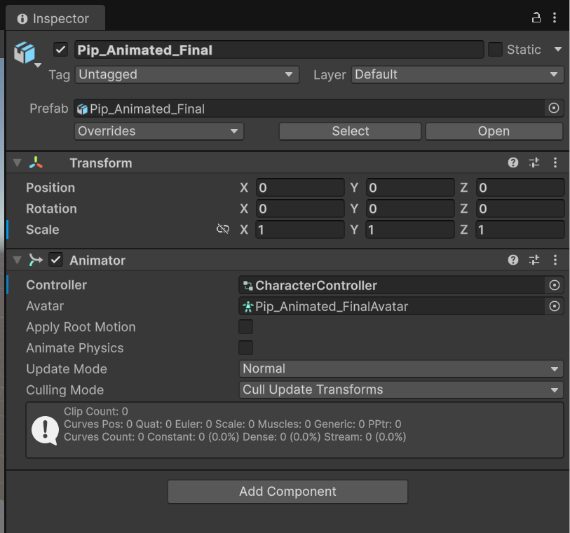
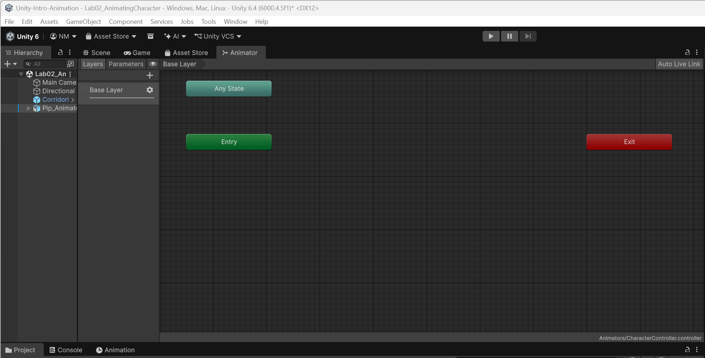
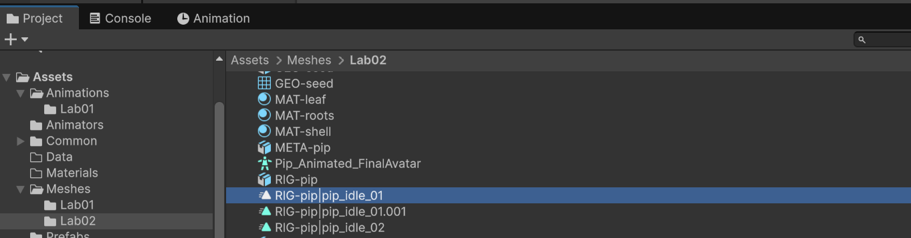
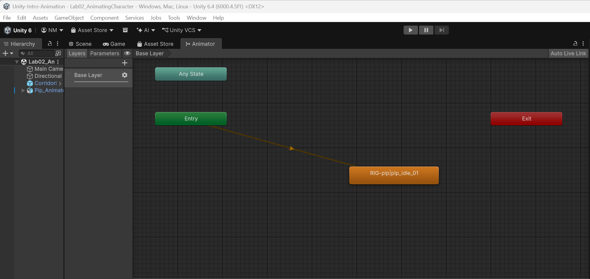
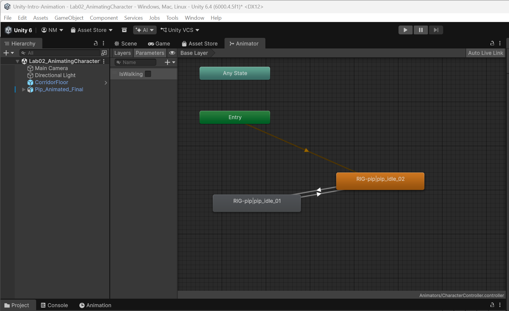
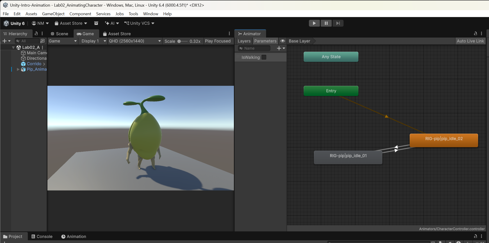

# Lab 2: Animating a Character
> **Prerequisites:**
> - You completed **Lab 1** and understand what an Animation Clip is.
> - You have your `Character.fbx` from your Blender module — it must contain a rigged mesh and two embedded animation clips (`Idle` and `Walk`), with the walk cycle authored **in-place** (the character's root does not translate forward).
> - You can identify the Animator window in the Unity Editor.
> - You have cloned the labs [repo](https://github.com/nmcguinness/Unity-Intro) to your machine. 

---

## **What you'll learn**

| Skill Type | You will be able to… |
| :-- | :-- |
| **Conceptual Understanding** | Explain what an Animator Controller is, what a state machine is, and how a Bool parameter drives transitions between states. |
| **Editor & Tool Fluency** | Import a rigged FBX from Blender, extract embedded animation clips, build states from clips, and wire transitions with conditions. |
| **Design Skills** | Choose between Bool, Float, Int, and Trigger parameters for different transition rules. |
| **Problem-Solving** | Diagnose the three most common Animator issues: wrong rig type, missing animation, and laggy transitions. |

---

## **Why this matters**
Real games don't play one animation forever. Characters **idle**, **walk**, **react**, and **die**, often within a single second of gameplay. A character who plays a single looping walk animation regardless of context reads as a puppet with one string. A character who can switch between Idle, Walk, Run, Jump, and Hurt — driven by what's happening in the game — reads as a participant in the world.

The Animator Controller is Unity's tool for managing those transitions cleanly, without writing a giant `if/else` ladder in code. By the end of this lab, your character will smoothly switch between two animations driven by a single Bool parameter — the simplest, cleanest version of the pattern used in commercial games for everything from locomotion to combat. The same architectural pattern scales from a 2-state controller (used today) to the 200+-state controllers used in shipped AAA games. The *complexity* grows; the *concepts* don't.

This lab also introduces a piece of Unity's character pipeline that catches every beginner: the **Generic vs Humanoid rig** decision. Pick wrong and your character will appear in T-pose or twist into impossible shapes the moment the clip plays. Get it right and the rest is straightforward.

---

## **How this builds on previous content**
**From Lab 1 you know:**
- An Animation Clip stores keyframed property changes.
- Unity auto-generates an Animator Controller when you create your first clip.
- The Animation window (where you author clips) and the Animator window (where you author controllers) are different things.

**Lab 2 zooms in on that Controller:**
- Instead of one auto-generated state, you'll author **two** states from your Blender clips.
- Instead of always playing, the Controller will **decide** which state plays based on a Bool parameter `IsWalking`.
- Instead of authoring clips yourself, you'll use clips you authored in your Blender module — `Idle` and `Walk` — as the recordings the controller switches between.

**This sets up Lab 4**, where a script will drive the transition logic from keyboard input — and where you'll deliberately *upgrade* this Bool-driven controller to a Float-driven one, learning *why* you'd swap parameter types in the first place. Today's choice of Bool is intentionally simple; Lab 4 makes the case for Float when input becomes a continuous variable rather than a binary state.

---

# **Core Ideas / Concepts**

> Each idea is introduced briefly here and revisited concretely in the lab steps. Read these once before starting.

---

### **Core Idea 1 — A state machine answers one question: "what is the character doing right now?"**

At any moment, the character is in exactly **one state** (Idle or Walk). A *transition* defines the rule for moving from one state to another — for example, "from Idle, transition to Walk if `IsWalking` becomes true."

**Snippet explanation:**
You don't write transitions in code. You draw them as arrows in the Animator window. Each arrow has **conditions** — predicate expressions like "`IsWalking` is true" — that the Animator evaluates each frame. When all the conditions on an outgoing arrow are met, the Animator follows the arrow to the destination state. This is visual programming, and it's why the Animator window exists: state machines are vastly easier to reason about as diagrams than as `switch` statements with 50 cases.

---

### **Core Idea 2 — Parameters are the inputs to your state machine**

A parameter is a value the Animator reads to decide transitions. Unity offers four parameter types: `Float` (a number, e.g. `Speed = 3.4`), `Int` (a whole number, e.g. `WeaponID = 2`), `Bool` (a true/false flag, e.g. `IsCrouching = true`), and `Trigger` (a one-shot signal, e.g. fire a `Jump` command that auto-resets after consumption).

In this lab you'll create one **Bool** parameter called `IsWalking`.

**Snippet explanation:**
Today you'll set `IsWalking` manually by ticking a checkbox in the Animator window during Play mode — proving the wiring works without involving any input or scripting. In Lab 4 you'll set it from a script reading keyboard input. The Animator doesn't care where the value comes from — it just reacts to it. That separation between *who decides the value* and *what the value triggers* is fundamental: it lets the same Animator drive a player character or an AI character or a replay-system character with no changes to the controller.

---

### **Core Idea 3 — Generic rigs use the skeleton authored in Blender; Humanoid rigs remap to a standard human skeleton**

Unity supports two main rig types:

- **Humanoid:** Unity remaps your skeleton to a standard human skeleton with named bones (Hips, Spine, LeftUpperArm, etc.). Animations authored on *any* humanoid can be retargeted to *any* other humanoid. This is great for libraries like Mixamo where you download generic animations and apply them to whatever humanoid you import.
- **Generic:** Unity uses your skeleton as-is, with whatever bones Blender exported. No remapping. Animations are tightly coupled to the rig they were authored on.

For Blender characters made for a specific project — including yours — you almost always want **Generic**. Your character's skeleton is custom; your animations are authored on that custom skeleton; there's no reason to retarget.

**Snippet explanation:**
This is the single most important setting in the import inspector. Wrong choice = broken character. Pick Humanoid on a non-standard rig and Unity will try to map your bones to the standard humanoid skeleton, fail at the parts that don't match, and produce a character that twists, T-poses, or has limbs in the wrong places. Pick Generic when you should have picked Humanoid and you lose the ability to use third-party humanoid animations — a smaller cost. When in doubt for a custom Blender character: **Generic**.

---

### **Core Idea 4 — `Has Exit Time` controls *when* a transition can fire**

When `Has Exit Time` is **on**, a transition only fires after the current clip has played to a specific point (e.g. 95% of the way through). When **off**, the transition fires the moment its conditions are met, regardless of where in the current clip you are.

**Snippet explanation:**
For locomotion (Idle ↔ Walk), you almost always want `Has Exit Time` **off** — the character should react instantly to input. If a player presses W and the character keeps idling for 0.4 seconds before transitioning to Walk because the Idle clip hasn't finished, the game feels broken. Forgetting to uncheck `Has Exit Time` is the #1 reason beginner Animators feel "laggy."

When *would* you want it on? For animations that must complete before transitioning — a sword-swing attack, a finishing move, a casting animation. You want the swing to finish before the character can do anything else. For locomotion, never.

---

# **Progressive Lab Steps (A → B → C → D → E)**

> Total budget: **30 minutes**. Save your scene at the end of each step.

---

### Step A — Import the Blender character & verify the rig (6 min)

Create a new scene in your Unity project. Name it `Lab02_AnimatingCharacter` inside `Assets/Scenes/`.

Drag your `Character.fbx` from your file explorer into a new `Assets/Models/` folder in the Project window. The import will take a few seconds.

Now click on `Character.fbx` in the Project window. The Inspector shows several tabs at the top: **Model**, **Rig**, **Animation**, **Materials**. Configure each:

**Model tab:**
- Confirm `Convert Units` is ticked (handles Blender's Z-up convention).
- Click Apply at the bottom of the Inspector.

**Rig tab:**
- Set `Animation Type` to **Generic** (this is the key setting — see Core Idea 3).
- Set `Avatar Definition` to `Create From This Model` — this tells Unity to build an Avatar (a description of which bones serve which animation purpose) from the rig as it stands.
- Click Apply.

**Animation tab:**
- You should see a list of clips embedded in the FBX — `Idle` and `Walk`. If you don't see them both, check with your Blender lecturer that both actions were exported.
- Click each clip in turn. For each, scroll down the Inspector to find `Loop Time` and ensure it's ticked. Both `Idle` and `Walk` are looping animations.
- Click Apply.

Now build the scene. In the Hierarchy, right-click → `3D Object > Plane`. Rename it `CorridorFloor` and position it at `(0, 0, 0)`. Drag your `Character` from the Project window into the Hierarchy. Position it at `(0, 0, 0)`.

**Checkpoint:** Character stands upright on the floor. Expand it in the Hierarchy — you should see a bone hierarchy under the mesh (entries with names like `Hips`, `Spine`, `LeftArm`, etc.). If the character is lying on its side, you skipped `Convert Units`. If the bone hierarchy is missing, the FBX exported as mesh-only — re-export from Blender with the armature included.

<div style="border:1px solid #ccc; border-radius:8px; padding:12px; margin:12px 0; background:#f9f9f9;">
<details>
<summary><strong>Blender to Unity: FBX Export Settings (Animation)</strong></summary>

---

### Export Path
`File → Export → FBX (.fbx)`

---

### Include
- ✔ Selected Objects *(export only what you need)*
- ✔ Mesh
- ✔ Armature  
- ✖ Cameras / Lights *(disable)*

---

### Transform
- ✔ Apply Transform

---

### Armature
- ✔ Only Deform Bones  
- ✖ Add Leaf Bones *(must be OFF)*  
- ✔ Apply Unit

---

### Animation
- ✔ Bake Animation  
- ✔ NLA Strips *(required for multiple animations)*  
- ✔ All Actions  
- Sampling Rate: `1` *(default is fine)*

---

### Common Mistakes (avoid these)
- Animations missing → not pushed to NLA  
- Extra bones in Unity → Leaf Bones left ON  
- Broken scale → transforms not applied  
- Only one animation exported → “All Actions” unchecked  

---

### Mental Model
*Mesh + Armature + Baked Keyframes → FBX*  
Unity splits this into animation clips automatically.

</details>
</div>

---

### Step B — Create the Animator Controller (4 min)

Create a new folder `Assets/Animators/`. Right-click inside it → `Create > Animator Controller`. Name the asset `CharacterController.controller`.

Drag the new `.controller` asset onto the `Character` GameObject in the Hierarchy. This assigns it to the character's existing `Animator` component (every imported rigged FBX gets an Animator component automatically).

<a href="./images/Lab01/l2.1.png" target="_blank" rel="noopener">
  
</a>

While you have the Character selected, look at its `Animator` component in the Inspector and **untick** `Apply Root Motion`. Your walk cycle is in-place — the bones move, the root doesn't translate. We'll handle locomotion via script in Lab 4. Leaving root motion enabled with an in-place walk cycle does nothing visible today but causes confusing bugs in Lab 4, so set it correctly now.

<a href="./images/Lab01/l2.2.png" target="_blank" rel="noopener">
  
</a>

Open the Animator window via `Window > Animation > Animator`. Note: this is **Animator** (singular), not Animation (which is the clip authoring window from Lab 1). The window opens showing an empty state machine — three rectangles labelled `Entry`, `Exit`, and `Any State` floating in a dark grid.

**Checkpoint:** The `Character` has its `Animator` component pointing at `CharacterController.controller`. `Apply Root Motion` is unticked. The Animator window is open and shows the empty state machine.

---

### Step C — Add the two states (5 min)

You'll now populate the state machine with your Blender clips.

<a href="./images/Lab01/l2.3.png" target="_blank" rel="noopener">
  
</a>

In the Project window, expand `Character.fbx` (click the small triangle next to it). Inside, you'll see the clips appear as triangular animation-clip icons named `Idle` and `Walk`. Drag `Idle` into the Animator window. A new state appears, named `Idle`, with an arrow automatically running from `Entry` to it (because it became the default state). Drag `Walk` in the same way. A second state appears.

<a href="./images/Lab01/l2.4.png" target="_blank" rel="noopener">
  
</a>

> If `Idle` didn't become the default automatically (you'd see it in grey rather than orange), right-click it → `Set as Layer Default State`. The orange colour confirms the default — when the game starts, the character begins in this state.

Press Play. The character should idle in place. Stop.

**Checkpoint:** Two states visible in the Animator window. `Idle` is orange (default). An arrow runs from `Entry` to `Idle`. Pressing Play makes the character idle on the floor.

---

### Step D — Add the IsWalking parameter and transitions (10 min)

The states exist, but nothing yet causes the Animator to switch between them. We need a parameter to read and transitions to traverse.

In the Animator window, look at the top-left for the **Parameters** tab (next to **Layers**). Click it. Click the small `+` button → choose `Bool` → name the parameter `IsWalking`. The new parameter appears with a checkbox next to it (currently unchecked).

Now wire the transitions:

1. Right-click the `Idle` state → `Make Transition`. Your cursor becomes a crosshair-with-arrow. Click the `Walk` state. An arrow appears from Idle to Walk.
2. Right-click the `Walk` state → `Make Transition`. Click `Idle`. A second arrow appears in the opposite direction.

<a href="./images/Lab01/l2.6.png" target="_blank" rel="noopener">
  
</a>

You now have two transitions. Both currently fire automatically (after a fixed delay), which is wrong. Configure them:

**Click the `Idle → Walk` transition arrow** (it'll highlight in blue). The Inspector shows the transition's properties. Configure:

- In the **Conditions** list at the bottom, click `+`. A new condition is added. Set it to `IsWalking` `true`.
- Find the **Has Exit Time** checkbox and **untick it**. The transition will now fire the moment the condition is met, not after the Idle clip completes.
- Set **Transition Duration** to about `0.1` (100 milliseconds). This gives a smooth blend between the two clips rather than a snap.

**Click the `Walk → Idle` transition arrow.** Configure symmetrically:

- Add condition `IsWalking` `false`.
- Untick `Has Exit Time`.
- Set Transition Duration to `0.1`.

**Checkpoint:** Two transitions visible, each with one condition and `Has Exit Time` off. The Animator window's Parameters tab shows `IsWalking` as a Bool with a checkbox.

---

### Step E — Test by toggling the parameter live (3 min)

<a href="./images/Lab01/l2.7.png" target="_blank" rel="noopener">
  
</a>

Arrange the `Animator` and `Game` window so they sit side by side. Press Play. The character idles on the floor — the same as in Step C.

Now, with the game still running, switch focus to the Animator window. In the Parameters panel, find the `IsWalking` checkbox and **tick it**. Watch the character — it should transition from Idle to Walk and start its walk cycle in place.

Untick the checkbox. The character transitions back to Idle.

Tick and untick a few times. Watch the state machine in the Animator window: you should see the active state (highlighted in blue) move between Idle and Walk, with a brief blend bar at the bottom showing the transition. The transitions should feel responsive — toggling the checkbox should produce an immediate switch, not a delayed one. If they feel sluggish, you forgot to untick `Has Exit Time` on a transition.

Stop the game.

**Checkpoint:** Toggling `IsWalking` in Play mode reliably moves the character between Idle and Walk states, with smooth (~0.1s) blends in both directions.

*(2-minute buffer for save and Tinker Tasks below)*

---

# **Tinker Tasks**

> Quick experiments. Try at least two before leaving the lab.

| Try this | Notice |
| :-- | :-- |
| Tick `Has Exit Time` on `Idle → Walk` and play | The character finishes its idle loop *first*, then transitions — feels sluggish |
| Set `Transition Duration` to `0` on both transitions | Animation snaps between states with no blend — too harsh for locomotion |
| Set `Transition Duration` to `1.0` on both transitions | Way too smooth — character looks like it's drunk-walking. Sweet spot is `0.1`–`0.25`. |
| Toggle `Apply Root Motion` on (in the Animator component) | If your walk cycle has any root translation at all, the character drifts. Confirms why we keep it off for in-place clips. |
| In the Animator window, drag the `Walk` state to where `Idle` is and vice versa | Visual layout has no effect on behaviour — the wiring is what matters. Useful when state machines get cluttered. |

---

# **Useful Editor Tricks**

| Trick | Why it helps |
| :-- | :-- |
| Scrubbing parameters live in Play mode | Lets you test transitions without writing a line of code |
| Animator window's preview pane (bottom strip) | Shows which state is currently active and how blended it is |
| Right-click a transition → `Solo` | Disables all other transitions temporarily — useful when arrows tangle |
| Right-click a transition → `Mute` | Disables the transition entirely without deleting it — useful for debugging |
| Hold middle mouse button and drag in the Animator window | Pans the view — easier than scrolling |

---

# **Debugging & Pitfalls**

| Mistake | Why it happens | Fix |
| :-- | :-- | :-- |
| Character imports as Humanoid and looks broken | Default rig type chosen by accident, or you ticked Humanoid expecting magic | Inspector → Rig tab → set `Animation Type` to `Generic`, click Apply |
| Character drifts forward during Walk | Walk clip has root motion baked in, or `Apply Root Motion` is on | Untick `Apply Root Motion` on the Animator component. If the clip itself has root translation, fix in Blender (re-export in-place) |
| Transitions feel laggy or delayed | `Has Exit Time` is left enabled | Uncheck `Has Exit Time` on every transition |
| Walk doesn't loop | `Loop Time` not ticked on the clip asset | Project window → expand `Character.fbx` → select `Walk` → tick `Loop Time` in Inspector → Apply |
| `IsWalking` checkbox won't change in Animator window | Not in Play mode | Animator parameters are runtime-only — must be playing |
| Character imports without bones | Blender FBX exported as mesh-only | Re-export from Blender with armature included; check "Add Leaf Bones" is *off* (causes an extra bone in Unity) |
| Idle clip plays Walk's animation | Embedded clips share names accidentally, or the wrong clip was renamed | Inspect `Character.fbx` → Animation tab → confirm clip names map to correct frame ranges |
| Transition arrows are hard to click | Multiple transitions stacked on top of each other | Click an empty area of the Animator window first to deselect, then carefully click the visible arrow |
| Can't make a transition — the Make Transition option is greyed out | You right-clicked the wrong state (Entry / Any State / Exit) | Right-click the *user state* (Idle or Walk), not the entry/exit nodes |

---

# **Reflective Questions**

- Why did you uncheck `Has Exit Time` for every transition? When *would* you want it on?
- The `IsWalking` parameter is currently set manually in the Animator window. What needs to change in Lab 4 to drive it from a keyboard?
- What's the difference between **states** in this lab and **keyframes** in Lab 1?
- You chose **Generic** rig over **Humanoid**. What scenario would push you to choose Humanoid in a future project?
- Predict: in Lab 4 we'll replace `IsWalking` (Bool) with `Speed` (Float). What advantage does a Float give us that a Bool cannot offer? (Try to answer in 2–3 sentences before reading Lab 4.)

---

# **Stretch Task (optional, take-home)**
Lab 4 will replace the `IsWalking` Bool with a `Speed` Float for finer control. Before that lab, predict: what would change in this Animator if you switched `IsWalking` (Bool) to `Speed` (Float)? What would the transition conditions look like? What thresholds might you choose?

*Write your answer in 2–3 sentences. We'll compare with the actual Lab 4 setup.*

If you want to push further: try adding a third state right now. Drag in your `Idle` clip a second time, rename the new state `IdleAlternate`, and add a transition from `Idle → IdleAlternate` with a condition of `Has Exit Time` set to fire after the Idle clip completes (this is the rare case where Has Exit Time *is* useful — it lets you cycle through idle variations without an external trigger). The character will now alternate between two copies of the same Idle, demonstrating that the controller will happily orchestrate any number of states.

---

## Files produced by end of lab
- `Assets/Models/Character.fbx` (your Blender import, contains Idle and Walk clips)
- `Assets/Animators/CharacterController.controller` (the controller you authored)
- `Assets/Scenes/Lab02_AnimatingCharacter.unity` (your scene)

---

## Lesson Context

```yaml
previous_lesson:
  topic_code: t01_anim_clip_basics
  domain_emphasis: Games

this_lesson:
  topic_code: t02_anim_controller_character
  primary_domain_emphasis: Games
  difficulty_tier: Foundational
  feeds_into: t04_input_animator_control
```
