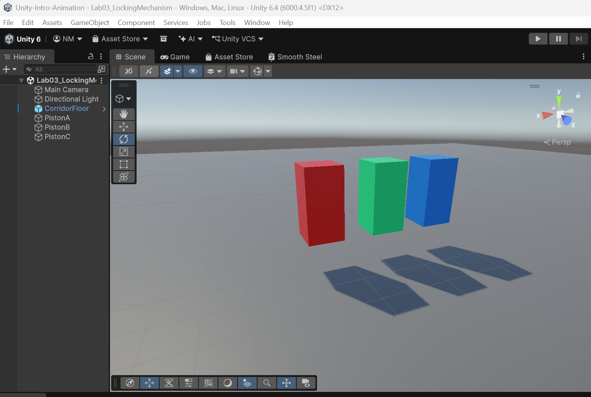
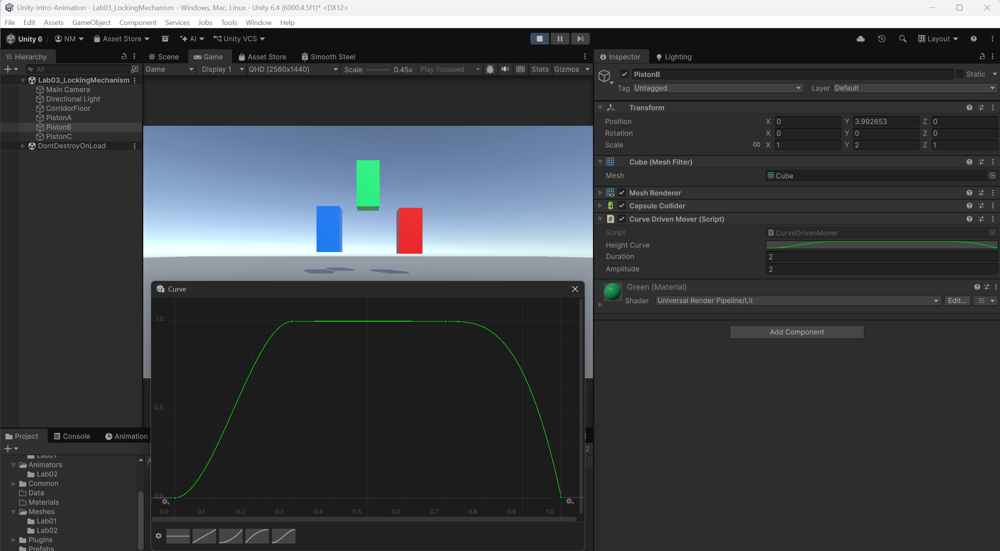

# Procedural Animation in Code
> **Prerequisites:**
> - You completed Labs 1 and 2.
> - You can read a basic C# class with `Update()` and `[SerializeField]`.
> - You have cloned the labs [repo](https://github.com/nmcguinness/Unity-Intro) to your machine.
> - DOTween is pre-installed and configured; a scene with three labelled cubes is provided.

---

## **What you'll learn**

| Skill Type | You will be able to… |
| :-- | :-- |
| **Conceptual Understanding** | Explain the difference between *authored* (timeline) and *procedural* (code) animation and identify when each is the right tool. |
| **Code Implementation** | Read, configure, and tinker with three complete scripts that drive a GameObject's transform via `Mathf.Sin`, `AnimationCurve.Evaluate`, and DOTween tween methods. |
| **Design Skills** | Choose appropriate easing functions (`Linear`, `OutQuad`, `OutBounce`) for different motion feels. |
| **Problem-Solving** | Diagnose missing-reference errors, frame-rate-dependent motion bugs, and tween-stacking issues. |

---

## **Why this matters**
Authored animation, the kind you produced in Labs 1 and 2, is perfect for character locomotion, cutscenes, and anything an artist hand-tunes for a specific feel. Authored animation has one limitation though: it's *fixed*. The same keyframes play the same way every time, regardless of what's happening in the game. That's exactly what you want for a walk cycle — and exactly what you don't want for an enemy that homes in on the player's runtime position, a UI panel that slides to a layout calculated at runtime, or a hundred coins that fly toward a HUD with slight per-coin variations.

**Procedural animation** is what you reach for when motion needs to respond to runtime values, when the same motion needs to happen many times with parameter variations, or when the motion is too systemic to author by hand (a camera follow, a homing missile, a screen shake). Real games use *both* paradigms in concert. Authored sets the baseline; procedural drives the moments that need to react to the world. This lab teaches you the procedural half.

You'll write three short scripts that all produce variations of "vertical motion" — a bob, a curve-shaped move, and a jump — but each uses a fundamentally different technique. By the end, you'll know when to reach for `Mathf.Sin`, when to reach for an `AnimationCurve`, and when to reach for a tweening library like DOTween.

---

## **How this builds on previous content**
**From Lab 1 you know:**
- What an `AnimationCurve` looks like — the green graph in the Curves tab of the Animation window.
- What easing feels like (flat tangents at the apex make the bounce hang; linear at impact makes it snap).

**From Lab 2 you know:**
- The Animator Controller is great for *discrete states* like Idle and Walk.
- It struggles when motion needs to be *continuously parameterised* by runtime values — you can't easily ask the Animator to "move toward a position the player just clicked" without a lot of extra wiring.

**Lab 3 brings curves *into code* and introduces tweening libraries:**
- The same `AnimationCurve` editor you used in Lab 1 is also a serialisable C# field. Drag it in the Inspector, evaluate it from a script. The bridge between authored and procedural turns out to be a single Unity type.
- You'll meet **DOTween**, an industry-standard tweening library used in shipped Unity titles. Tweening libraries collapse "move from A to B over T seconds with easing E" from 20 lines of timer code into a single method call.

**This sets up Lab 4**, where you'll script-drive the Animator from Lab 2 — combining authored character animation with procedural input handling in the same project.

---

# **Core Ideas / Concepts**

> Each idea is introduced briefly here and revisited concretely in the lab steps. Read these once before starting.

---

### **Core Idea 1 — Procedural motion is just maths over time**

Every Update tick, your script computes a new transform value from the current time and writes it to `transform.position` (or rotation, or scale). The choice of *what maths* you use determines what the motion feels like.

**Snippet explanation:**
`Mathf.Sin(Time.time)` produces a smooth oscillation between `-1` and `+1` as `Time.time` increases. Multiply the result by `amplitude` to control how far the motion travels; multiply `Time.time` by `speed` before the sine to control how fast it oscillates. This is the simplest possible procedural animation: a single line of code in `Update()`. It's also the foundation for floating UI elements, hovering collectibles, breathing motions on idle characters, and a hundred other small touches that bring scenes to life.

---

### **Core Idea 2 — `AnimationCurve` is a serialisable C# type**

The same curve editor from Lab 1 is exposed as a regular field. Drag it in the Inspector, then call `curve.Evaluate(t)` to read its value at time `t`. Whatever shape you draw in the editor becomes the value the script reads.

**Snippet explanation:**
This is the *bridge* between authored animation (Labs 1–2) and code-driven animation. The curve gives you visual control with code-level flexibility — the script computes the timing, the curve shapes the motion. It's the single most useful tool in your animation toolkit because it lets *designers* (who like visual editing) collaborate with *programmers* (who like parameterised systems) on the same feature. Use it everywhere you need shaped motion driven by a script.

---

### **Core Idea 3 — Easing functions encode motion personality**

`Linear` feels mechanical. `OutQuad` feels gentle. `OutBounce` feels playful. `InOutCubic` feels professional. The same start position, end position, and duration can produce wildly different *feels* depending on the easing function applied.

**Snippet explanation:**
Game feel is largely a story of *which easing curve, applied where*. UI panels slide in with `OutCubic`. Collectibles fly to the HUD with `InBack`. Damage numbers pop with `OutExpo`. Knowing the standard easing vocabulary lets you describe motion intent to artists, replicate references quickly, and avoid the dreaded "looks robotic" feedback. DOTween exposes these as the `Ease` enum — you'll see `Ease.OutBounce` in Step D below.

---

### **Core Idea 4 — DOTween wraps procedural motion in a one-liner**

What would take 20 lines of `Mathf.Lerp` and timer management collapses to one chained call. DOTween handles the timing, easing, and lifecycle. You'll use it any time you need *one-shot* motion (a UI panel entrance, a power-up grab, a screen shake, a door opening) rather than a *continuous* loop.

**Snippet explanation:**
The pattern is `transform.DOSomething(target, duration).SetEase(Ease.X).OnComplete(callback)`. Each method returns the tween, so you can chain configuration calls. The chaining style — known as a **Fluent Builder pattern** — reads almost like English: "transform, do jump to target with duration, set ease to OutBounce, on complete call this method." Same pattern as LINQ in C# or Stream in Java. Once you've used it for a while, hand-rolled timer code feels archaic.

---

# **Progressive Lab Steps (A → B → C → D → E)**

> Total budget: **30 minutes**.
> The starter scene contains three cubes labelled `PistonA`, `PistonB`, `PistonC`, side by side.
> **You will not write code from scratch.** Each script below is provided complete. Your job is to read it, paste it into a new C# file, attach it to the right cube, configure it in the Inspector, and tinker with the values.

---

### Step A — Inspect the starter and verify DOTween (3 min)

<a href="./images/Lab03/l3.1.png" target="_blank" rel="noopener">
  
</a>

Open the  [repo](https://github.com/nmcguinness/Unity-Intro) in Unity 6.3 LTS. The scene `Assets/Scenes/Lab03_LockingMechanism.unity` should open automatically; if not, open it manually.

Check three things in the Project window:

1. The Hierarchy contains three GameObjects named `PistonA`, `PistonB`, `PistonC`.
2. The folder `Assets/Plugins/Demigiant/DOTween/` exists. (If not, open the Unity Asset Store, search for the free version of [DOTween](https://assetstore.unity.com/packages/tools/animation/dotween-hotween-v2-27676), and add to your project.)
3. The folder `Assets/Scripts/` is empty. You'll create three scripts here.

Press Play in the editor briefly. The cubes sit in place doing nothing — that's expected. Stop.

**Checkpoint:** Three cubes visible in the Game view, scene plays without errors, DOTween folder present in Plugins.

---

### Step B — `PistonA`: trigonometric bobbing (6 min)

In the Project window, right-click inside `Assets/Scripts/` → `Create > MonoBehaviour Script`. Name the new file `BobUpDown.cs`. Double-click it to open in your IDE (Visual Studio, Rider, or VS Code depending on your machine setup).

**Replace the entire file contents** with the code below. Read the comments — they explain every line.

```csharp
using UnityEngine;

/// <summary>
/// Bobs a GameObject up and down using a sine wave.
/// This is the simplest possible procedural animation — pure maths over time.
/// Attach to: PistonA in the Lab03_LockingMechanism scene.
/// </summary>
public class BobUpDown : MonoBehaviour
{
    // [SerializeField] makes a private field visible and editable in the Inspector.
    // Tinker with these values at runtime to feel how each parameter changes the motion.

    [SerializeField, Tooltip("How fast the cube bobs (oscillations per second).")]
    private float speed = 2f;

    [SerializeField, Tooltip("How high/low the cube travels from its starting position, in world units.")]
    private float amplitude = 1f;

    // We cache the starting position once in Start().
    // If we computed motion relative to transform.position every frame, the cube
    // would drift because we'd be adding offsets on top of an already-moved position.
    private Vector3 startPos;

    // Start() is called once before the first frame. Perfect place to cache references.
    private void Start()
    {
        startPos = transform.position;
    }

    // Update() runs every frame. We compute a new Y offset from a sine wave.
    private void Update()
    {
        // Time.time = seconds since the game started.
        // Mathf.Sin returns a smooth oscillation between -1 and +1.
        // Multiplying time by `speed` controls how fast the wave oscillates.
        // Multiplying the result by `amplitude` controls how far up/down it travels.
        float yOffset = Mathf.Sin(Time.time * speed) * amplitude;

        // Set the cube's position to its starting position plus the Y offset.
        // Vector3.up is shorthand for new Vector3(0, 1, 0).
        transform.position = startPos + Vector3.up * yOffset;
    }
}
```

Save the file. Return to Unity and wait a moment for the script to compile (you'll see a small progress wheel in the bottom-right of the editor).

Drag `BobUpDown.cs` from the Project window onto `PistonA` in the Hierarchy. Look at `PistonA` in the Inspector — there's now a `Bob Up Down (Script)` component with `Speed` and `Amplitude` fields.

Press Play. `PistonA` bobs smoothly up and down. While the game is still running, change the `Speed` and `Amplitude` values in the Inspector — the motion responds in real time.

**Checkpoint:** `PistonA` bobs smoothly. Tuning `Speed` and `Amplitude` in the Inspector during Play mode visibly changes the motion.

---

### Step C — `PistonB`: `AnimationCurve`-driven motion (8 min)

Create a new script in the same way: right-click `Assets/Scripts/` → `Create > MonoBehaviour Script`. Name it `CurveDrivenMover.cs`. Open it and replace the contents with:

```csharp
using UnityEngine;

/// <summary>
/// Moves a GameObject up and down following the shape of an AnimationCurve.
/// Same kind of curve as you authored in Lab 1, but evaluated from code.
/// This is the bridge between authored animation and procedural animation.
/// Attach to: PistonB in the Lab03_LockingMechanism scene.
/// </summary>
public class CurveDrivenMover : MonoBehaviour
{
    [SerializeField, Tooltip("Author this curve in the Inspector. X axis = normalised time (0 to 1), Y axis = output value (multiplied by amplitude).")]
    // EaseInOut(0,0,1,1) gives us a sensible default smooth ramp from 0 to 1.
    // Click the curve field in the Inspector to edit it visually.
    private AnimationCurve heightCurve = AnimationCurve.EaseInOut(0f, 0f, 1f, 1f);

    [SerializeField, Tooltip("How long one full cycle takes, in seconds.")]
    private float duration = 2f;

    [SerializeField, Tooltip("Multiplier applied to the curve's output value.")]
    private float amplitude = 2f;

    private Vector3 startPos;

    private void Start()
    {
        startPos = transform.position;
    }

    private void Update()
    {
        // Compute a normalised time `t` that loops from 0 to 1 over `duration` seconds.
        // The `%` (modulo) operator wraps the value back to 0 each time it hits `duration`,
        // and dividing by duration normalises the result into [0, 1) for curve evaluation.
        float t = (Time.time % duration) / duration;

        // Evaluate the curve at `t`. The curve decides what value comes out — a step,
        // a smooth ease, a wobble, anything you can draw in the curve editor.
        float curveValue = heightCurve.Evaluate(t);

        // Apply that value as a Y offset from the starting position.
        transform.position = startPos + Vector3.up * curveValue * amplitude;
    }
}
```

Save. Wait for compilation. Drag the script onto `PistonB`.

Now author the curve. With `PistonB` selected, find the `Height Curve` field in the Inspector and click on the curve preview. The curve editor opens in a separate window. The default curve goes smoothly from `(0, 0)` to `(1, 1)` — try authoring a more interesting shape:

- Click on the curve to add new keyframes.
- Right-click any keyframe for tangent options (the same Flat / Linear / Auto options you used in Lab 1).
- A good first attempt: a curve that ramps up sharply from `t=0` to `t=0.3`, plateaus until `t=0.7`, then drops sharply back to 0 at `t=1`. This produces a "step up, hold, step down" motion — exactly what a locking piston should do.

<a href="./images/Lab03/l3.2.png" target="_blank" rel="noopener">
  
</a>

Press Play. Compare `PistonB` with `PistonA` — same axis of motion, but `PistonB`'s motion follows whatever shape you drew, not a smooth sine wave. If you want a square-wave-like step motion, `PistonB` can do it; `PistonA` can't.

**Checkpoint:** `PistonB`'s motion follows the authored curve shape exactly. Re-editing the curve while in Play mode visibly changes the motion.

---

### Step D — `PistonC`: DOTween one-liner (8 min)

Create a third script: `Assets/Scripts/DoTweenJump.cs`. Replace the contents with:

```csharp
using UnityEngine;
using DG.Tweening;  // DOTween namespace. "DG" stands for Demigiant (the developer).

/// <summary>
/// Makes a GameObject hop back and forth using DOTween's DOJump method.
/// Demonstrates how a tweening library compresses ~20 lines of timing code into
/// one chained call.
/// Attach to: PistonC in the Lab03_LockingMechanism scene.
/// </summary>
public class DoTweenJump : MonoBehaviour
{
    [SerializeField, Tooltip("How high the jump arcs.")]
    private float jumpPower = 2f;

    [SerializeField, Tooltip("How long each jump takes, in seconds.")]
    private float duration = 1f;

    [SerializeField, Tooltip("How far to jump sideways from the starting position.")]
    private float horizontalDistance = 2f;

    [SerializeField, Tooltip("The easing function — controls the 'personality' of the motion. Try OutBounce, InBack, Linear.")]
    private Ease easeType = Ease.OutBounce;

    private Vector3 startPos;

    private void Start()
    {
        startPos = transform.position;

        // Kick off the loop. JumpRight chains JumpLeft via OnComplete, and
        // JumpLeft chains back to JumpRight, producing an infinite back-and-forth.
        JumpRight();
    }

    /// <summary>
    /// Jumps to the right, then chains JumpLeft() when complete.
    /// </summary>
    private void JumpRight()
    {
        Vector3 target = startPos + Vector3.right * horizontalDistance;

        // .DOJump animates the transform along an arc to `target` in `duration` seconds,
        //   completing `1` jump along the way.
        // .SetEase chooses the easing curve — OutBounce gives the satisfying "land" feel.
        // .OnComplete schedules JumpLeft when the tween finishes.
        // The chained-call style is DOTween's idiomatic Fluent Builder pattern.
        transform.DOJump(target, jumpPower, 1, duration)
                 .SetEase(easeType)
                 .OnComplete(JumpLeft);
    }

    /// <summary>
    /// Jumps back to the start position, then loops by calling JumpRight() again.
    /// </summary>
    private void JumpLeft()
    {
        transform.DOJump(startPos, jumpPower, 1, duration)
                 .SetEase(easeType)
                 .OnComplete(JumpRight);
    }

    /// <summary>
    /// IMPORTANT: kill all tweens on this transform when the GameObject is disabled
    /// or destroyed. DOTween tweens persist by default — leaving them alive on a
    /// destroyed object causes errors. Always kill in OnDisable for objects with a
    /// finite lifetime.
    /// </summary>
    private void OnDisable()
    {
        transform.DOKill();
    }
}
```

Save. Wait for compilation. If the editor shows an error like *"The type or namespace name 'DG' could not be found"*, DOTween hasn't been properly set up — see the Pitfalls table below for the fix.

Drag `DoTweenJump.cs` onto `PistonC`.

Press Play. `PistonC` hops to the right, then back to the left, repeating indefinitely. With the game running, change the `Ease Type` dropdown in the Inspector to different values (`Linear`, `OutQuad`, `InBack`, `OutBounce`) — each produces a dramatically different feel using the *exact same* keyframes underneath. This is Core Idea 3 in action.

**Checkpoint:** `PistonC` hops left and right; changing the `Ease Type` dropdown produces visibly different motion personalities.

---

### Step E — Side-by-side comparison & reflection (3 min)

Press Play with all three pistons active. Watch them simultaneously:

- `PistonA` (BobUpDown): smooth, sinusoidal, eternal — nothing can change its rhythm except the parameters.
- `PistonB` (CurveDrivenMover): shape-controlled — whatever you drew in the curve, that's what it does.
- `PistonC` (DoTweenJump): one-shot motion chained into a loop — feels like it has *intent* (jump there, come back).

Discuss with the person beside you (or note for yourself):
- Which approach is easiest to author? Which is easiest to *reuse* across projects?
- Which approach is cheapest to compute? (Hint: the sine wave is essentially free; tweens have small overhead per active tween.)
- If you needed 100 of these in a scene, which would you use?

**Checkpoint:** All three pistons animate simultaneously, each script's parameters visible and editable in the Inspector.

*(2-minute buffer for save and Tinker Tasks below)*

---

# **Tinker Tasks**

> Quick experiments. Try at least three before leaving the lab.

| Try this | Notice |
| :-- | :-- |
| Set `PistonA`'s `speed` to `0` in Play mode | The cube freezes — sine wave stops oscillating when its argument doesn't change |
| Author a flat horizontal line in `PistonB`'s curve | Cube barely moves — the curve's *range* matters as much as its shape |
| Change `PistonC`'s `easeType` to `Ease.Linear` | Lifeless mechanical hop — proves easing carries the personality, not the trajectory |
| Set `PistonC`'s `duration` to `0.2` | Hyperactive jump — same easing, but speed completely changes feel |
| Open `BobUpDown.cs` and replace `Vector3.up` with `Vector3.right` | Cube bobs sideways — the maths is identical, only the axis changed |
| In `CurveDrivenMover`, set `duration` to `100` | Motion is glacial — `duration` controls the *full cycle time*, not the speed |

---

# **Useful Snippets (Guards & Helpers)**

### Cache the start position once

```csharp
private Vector3 startPos;
private void Start() { startPos = transform.position; }
```

**Why?**
A common bug is computing motion relative to `transform.position` *every frame* — the position drifts because the cube has already moved. Caching once in `Start()` and offsetting from the cached value keeps motion stable. All three scripts in this lab use this pattern.

### Kill tweens on disable

```csharp
private void OnDisable() { transform.DOKill(); }
```

**Why?**
DOTween tweens persist when a GameObject is disabled, causing errors if the object is destroyed mid-tween. Always kill tweens in `OnDisable` for objects with a finite lifetime — this is already in `DoTweenJump.cs`. The `Safe Mode` in DOTween's settings catches some of these errors automatically, but explicit cleanup is the defensive habit to build.

---

# **Debugging & Pitfalls**

| Mistake | Why it happens | Fix |
| :-- | :-- | :-- |
| `NullReferenceException` on `heightCurve.Evaluate` | Forgot to author the curve in the Inspector — though the default `EaseInOut` provides a fallback so this only happens if you deleted the field's value | Click the curve field in the Inspector and add at least 2 keyframes |
| Cube drifts off into space over time | Computing offset from `transform.position` instead of cached `startPos` | All three scripts cache `startPos` in `Start()` — don't change this |
| Motion feels jerky on slow machines | Using raw frame counts is wrong; using `Time.time` is right | All scripts use `Time.time` — this is correct and frame-rate independent |
| `using DG.Tweening;` shows red error | DOTween's setup wizard hasn't run; modules aren't activated | In Unity menu: `Tools > Demigiant > DOTween Utility Panel > Setup DOTween...`. The starter project should already have this done. |
| Tweens stack and motion gets weird | Calling `DOJump` every frame in `Update` instead of once | Tweens are *one-shot* — `DoTweenJump.cs` correctly chains via `OnComplete`, never via `Update` |
| `AnimationCurve` works in Editor but not in Build | Curve was not serialised | Already handled — `[SerializeField]` is on the field |
| Editor shows scripts but pistons don't animate | Script not attached to the right GameObject | Check the Inspector: each piston should have exactly one of the three scripts attached |
| Cubes are invisible in scene | Wrong scene loaded — opened the default scene rather than `Lab03_LockingMechanism.unity` | File → Open Scene → navigate to `Assets/Scenes/Lab03_LockingMechanism.unity` |

---

# **Reflective Questions**

- You worked with the same kind of motion three different ways today. For each of these scenarios, which approach would you choose and why?
  - A coin that flies from a defeated enemy to the HUD.
  - A pulsing glow on every collectible in the level (50+ instances).
  - A character's walk cycle.
- The `AnimationCurve` field in `CurveDrivenMover.cs` appears identical to the curve editor from Lab 1. What does that tell you about how Unity is built internally?
- Why is DOTween's chained-call syntax (`.SetEase(...).OnComplete(...)`) easier to read than equivalent `if`/`else` timer code?
- When would a designer prefer authored animation (Lab 1–2) over procedural?
- All three scripts in this lab share one pattern: cache something in `Start()`, use it every frame in `Update()`. Why is this pattern so common?

---

# **Stretch Task (optional, take-home)**
Modify `BobUpDown.cs` to use an `AnimationCurve` instead of `Mathf.Sin`. Author a curve that *only roughly* approximates a sine wave — does the cube still feel like it's bobbing? What does this tell you about how forgiving the human eye is with animation?
*Use `CurveDrivenMover.cs` as your reference. No walkthrough provided.*

If you want to push further: chain a sequence of three different DOTween motions on `PistonC` — for example, jump right, scale down, jump back. Use `Sequence` (look up `DOTween.Sequence()` in DOTween's documentation). This is the technique used to author complex one-shot motions like a UI panel entrance with multiple steps.

---

## Files produced by end of lab
- `Assets/Scripts/BobUpDown.cs`
- `Assets/Scripts/CurveDrivenMover.cs`
- `Assets/Scripts/DoTweenJump.cs`
- `Assets/Scenes/Lab03_LockingMechanism.unity` (from starter)

---

## Lesson Context

```yaml
previous_lesson:
  topic_code: t02_anim_controller_character
  domain_emphasis: Games

this_lesson:
  topic_code: t03_procedural_animation
  primary_domain_emphasis: Balanced
  difficulty_tier: Foundational
  feeds_into: t04_input_animator_control
```
